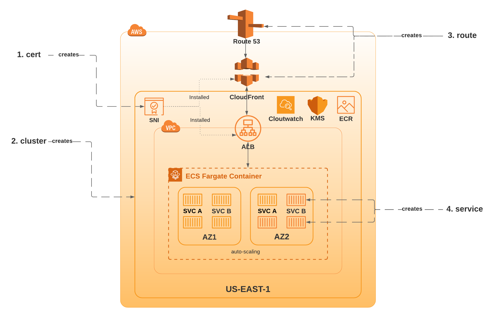

# Background
Lesscode is a playground for me to explore tools and techniques for writing less code to solve complex problems.


# Overview
*With the advancemet in cloud technology, IAC (Infrascructire As Code) was inveitable.*

The goal of this repo is to provide terraform modules to create/ destroy a simple microservice and serverless infrastructure stack. 
It does not create/destroy any data stack (yet). Feel free to clone n add modules to do that.

It is an opinionated framework, which helps to automate the creation and destruction of a microservice/ serverless, single region (multiple AZ) infrastructure for quick
build and deployment of apis, UIs and Q services.

If you are not writing a monolithic application then you are either writing a service oriented (SOA) or microservice applications. 

The **microservice** it builds uses :

1. **AWS Fargate** for orchestration and management of containers. It assumes that you are doing container (docker) based deployment.
2. **AWS ALB (Application load balancer)** for availibility, routing (via path) and service discovery (using DNS and path). Again, assumption here is that you are building a small to mid-size applications with 10s-100s of servers.
3. **Route53** and **Cloudfront** for external discovery and CDN routing.




# Usage

### Microservice 

Currently it only supports building a microservice in AWS. So create the follwoing terraform scripts for a new cluster deloyment.

main.tf
```
# 1st create a valid cert. Since we are using CF to map custom domain (via route module), we have to create it in us-east-1 region.
module "cert" {
    source = "github.com/van001/lciac//microservice/aws/cert"
    
    # domain name like dev.example.com
    domain = var.domain
    
    # zone id of the hosted domain in route 53
    zoneid = var.zoneid

    # aws region, in whihc this cluster will be created. e.g. "us-west-1"
    aws_region = var.aws_cert_region

    # development environment .e.g dev, stage, prod etc
    env = var.env

}

# Then create a new fargate cluster
module "cluster" {
    source = "github.com/van001/lciac//microservice/aws/cluster"
    
    # domain name like dev.example.com
    domain = var.domain
    
    # aws region, in whihc this cluster will be created. e.g. "us-west-1"
    aws_region = var.aws_region

    # development environment .e.g dev, stage, prod etc
    env = var.env

    # cluster name
    ecs_cluster_name = var.ecs_cluster_name

    # cert
    acm_certificate = module.cert.acm_certificate
}

# Then map the routing via route 53
module "routing" {
    source = "github.com/van001/lciac//microservice/aws/routing"
    
    # domain name like dev.example.com
    domain = var.domain
    
    # zone id of the hosted domain in route 53
    zoneid = var.zoneid

    # aws region, in whihc this cluster will be created. e.g. "us-west-1"
    aws_region = var.aws_region

    # development environment .e.g dev, stage, prod etc
    env = var.env

    # Alb name
    alb_dns_name = module.ms-cluster.alb_dns_name

    # ACM certificate id
    acm_certificate = module.cert.acm_certificate

}
```

vars.tf
```
variable "aws_region" {
    type = string
    default = "us-east-1"
}

variable "aws_cert_region" {
    type = string
    default = "us-east-1"
}
variable "env" {
    type = string
    default = "dev"
}


variable "zoneid" {
    type = string
    default = "Z3DW7T7D7J20Z4"
}

variable "domain" {
    type =  string 
    default = "dev.vethospital.io"
}

variable "ecs_cluster_name" {
    type = string
    default = "main-dev-us-west-1"
}
```

outputs.tf
```
output "alb_dns_name" {
  value = "${module.ms-cluster.alb_dns_name}"
}
```

# Under the hood
## Microservice
Contain all the terraform scripts to create a complete microservice environment from scratch. 
### In AWS

#### cert
Cert module helps create a valid ACM. If you are going to use 'route' module, which uses cloufront to route requests to ALB, you will have to create certificate in "US_EAST_1" region only.

1. Creates an ACM in the specified region
2. Updates Route53 entries to auto verify the created cert.

#### cluster
Cluster module create a brand new fargate cluster.

1. Creates an empty fargate cluster. No task or service definition yet. 
2. Creates and attach an application load balancer. 
3. Installs sepcified SNI certificate.

#### routing
Routing module maps the domain name via Route53 to CF/ ALB.

1. Map route 53 mapping to cluster.

#### service
Service module helps you create a brand new service. Service can be API or MQ (Message Q listeners).

1. Creates a new service.
2. Creates a task definition in the specified fargate cluster

